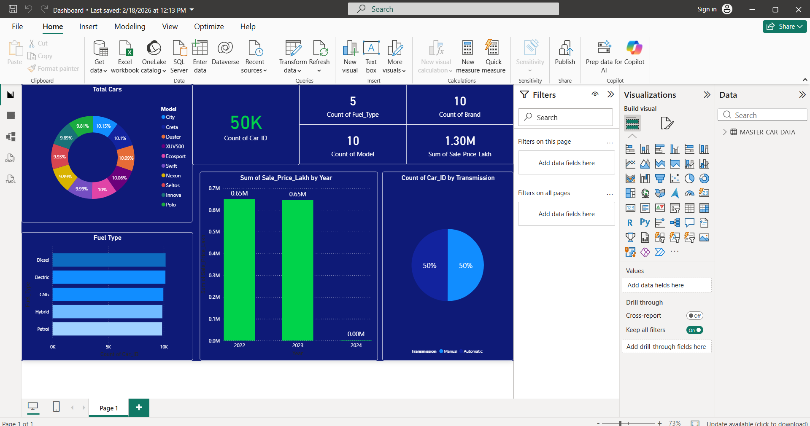

# Car-Sales-Dashboard
This project focuses on analyzing car sales data using Excel to track performance, identify trends, and build an interactive dashboard for business insights.

## 🎯 Objectives

- Analyze sales performance across regions and time

- Track key business metrics (KPIs)

- Build an interactive Excel dashboard

## 🛠️ Tools & Technologies

- Microsoft Excel

  - Power Query

  - Pivot Tables

  - Charts & Visualizations

 ## 📊 Dataset

- Contains car sales records

- Includes:

  - Sales Amount

  - Region

  - Date

  - Product/Car Model
 
## 🧹 Data Cleaning Process

- Cleaned raw dataset using Power Query

- Removed duplicates and blank values

- Standardized column formats

- Ensured consistent data types

## 📈 Analysis Performed

- Sales by region

- Monthly and yearly trends

- Top-performing products

- Revenue distribution

## 📊 Dashboard Features

- KPI Cards:

  - Total Sales

  - Average Sales

  - Growth trends

- Interactive slicers (filters)

- Dynamic charts for trend analysis

## 🔍 Key Insights

- Identified top-performing regions

- Observed seasonal sales trends

- Highlighted high-revenue product categories

## 📥 Dashboard File

Download the Power BI dashboard here:

- [car_sales_dashboard.pbix](Dashboard/car_sales_dashboard.pbix)

## 🚀 How to Use

1. Open Excel file

2. Use slicers to filter data

3. Analyze KPIs and charts

## 💡 Future Improvements

- Integrate SQL database

- Automate data refresh

## 👤 Author

- Vincent Bardekar
